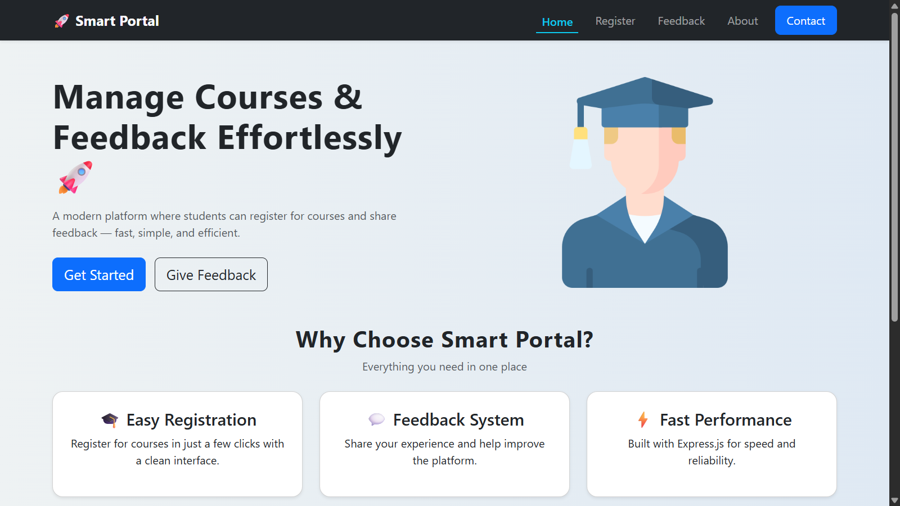
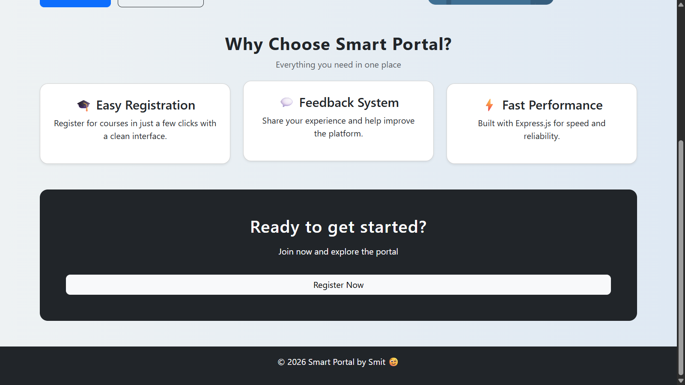
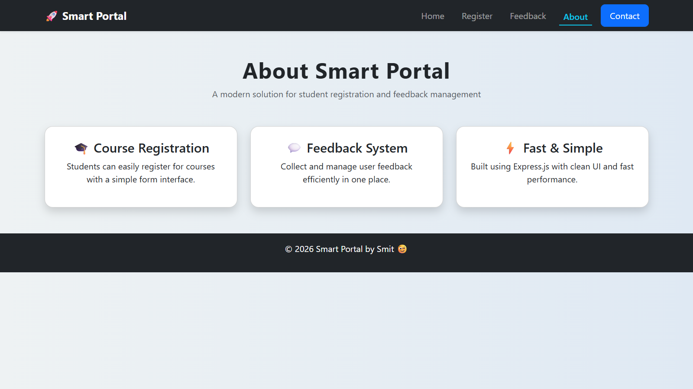
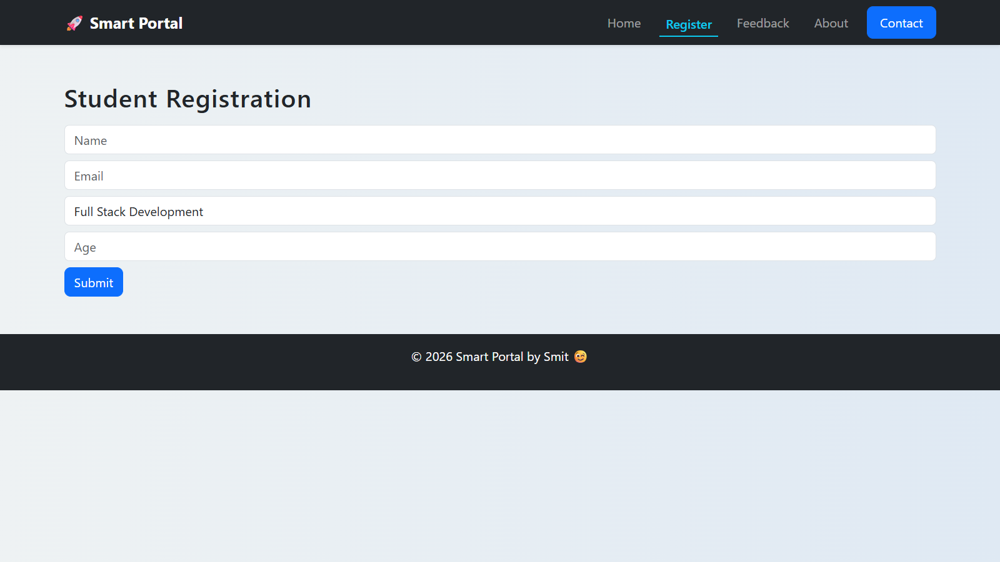
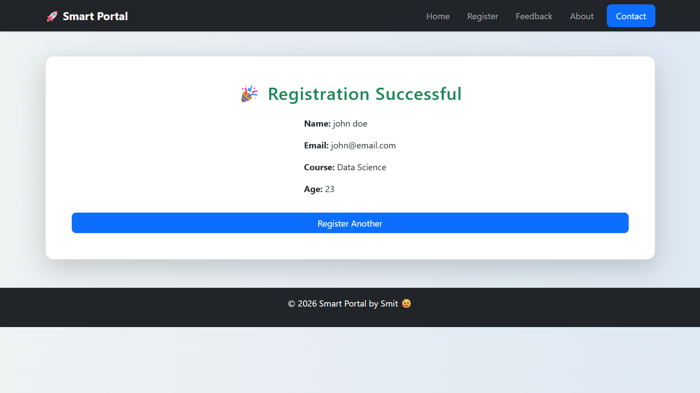
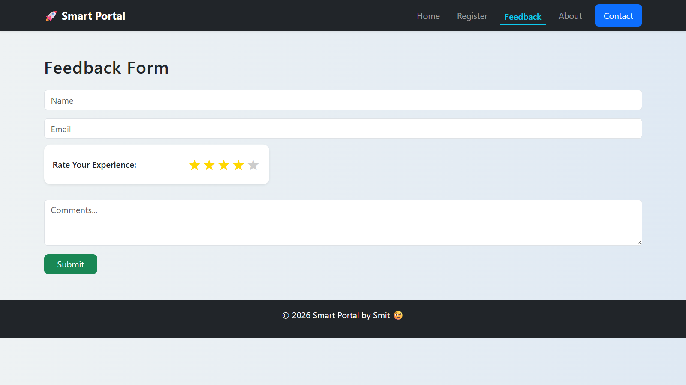
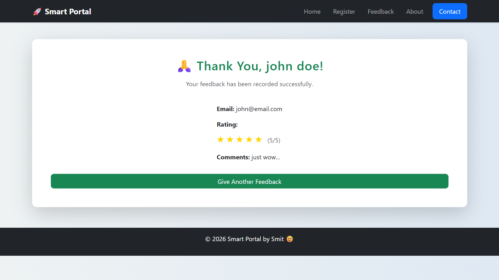
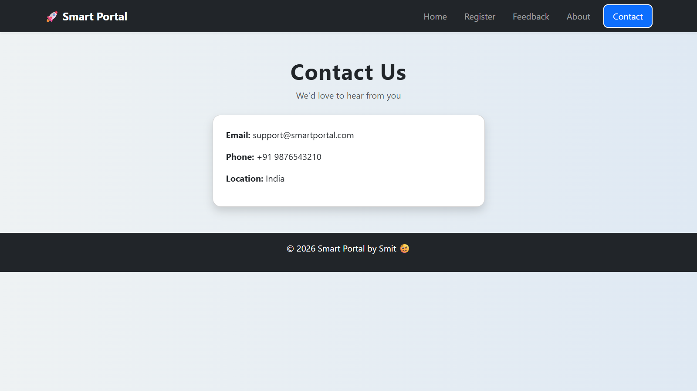

# Smart Portal 🚀

A combined web application built using Express.js.

## Features
- Student Course Registration
- Feedback Management System
- Dynamic Routing
- Middleware Logging
- Bootstrap UI

## Tech Stack
- Node.js
- Express.js
- EJS
- Bootstrap

## Run Project

```bash
node app.js
```
## Screenshots

### Home Page



### About Page


### Register Page



### Feedback Page



### Contact Page
